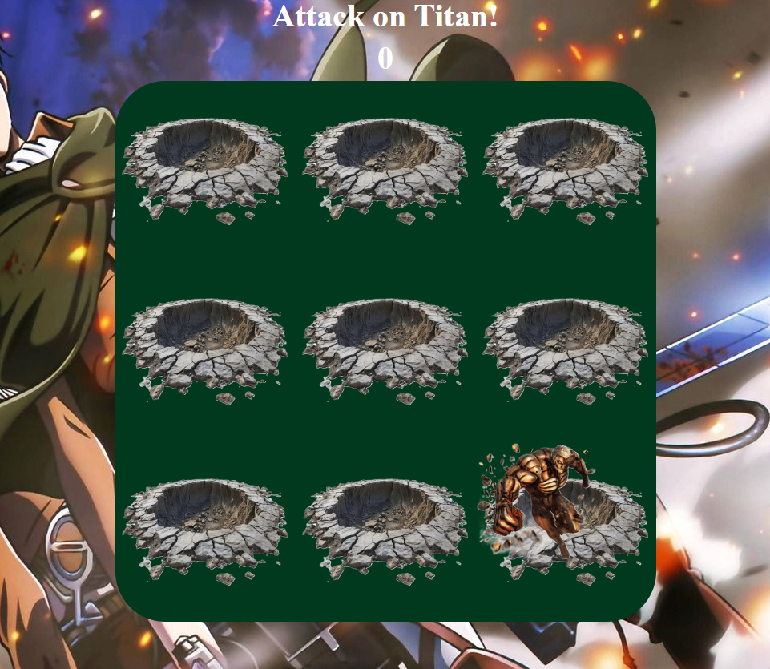

# ATTACK ON TITAN!!!

This isn't your typical Whack-A-Mole game... 

Everyone has probably seen whack-a-mole but now the moles are titans. The goal is to whack(attack) as many titans as you can without attacking a fellow scout.

Rules
Before you start you should toggle the help button (?). . .  

Once the game starts this button will no longer be available, so make sure you have a firm grasp of all the rules.

    * To 'attack' a Titan you must click on them.

    * Each time you defeat a titan you will have 10 points added to your score.

    * If you attack a fellow scout then the game is over.

    * There is a 2:00 time limit for this game.

    * See how many titans you can take down before it's all said and done!

Game/Planning 

Below I have provided a link to play the game as well as the planning tool I used to create it.  

[Play-Game](https://kierroman.github.io/AOT-Whack-a-Mole/) 

[Planning](https://trello.com/b/drbLL96e/kiers-board)

## Attribution:
 Here are a few sources I used to help me create this game.

    * MDN WebDocs
    * StackOverflow
    * BroCode (A Youtube Channel)
    * W3Schools

## Technologies
    * Javascript
    * CSS
    * HTML

## Next Steps: 
In the future I would like to take time to touch up the overall design of the game and possibly make an interactive home page that greets the user before loading the game page.

## Contact

Kier Roman -kierroman@gmail.com